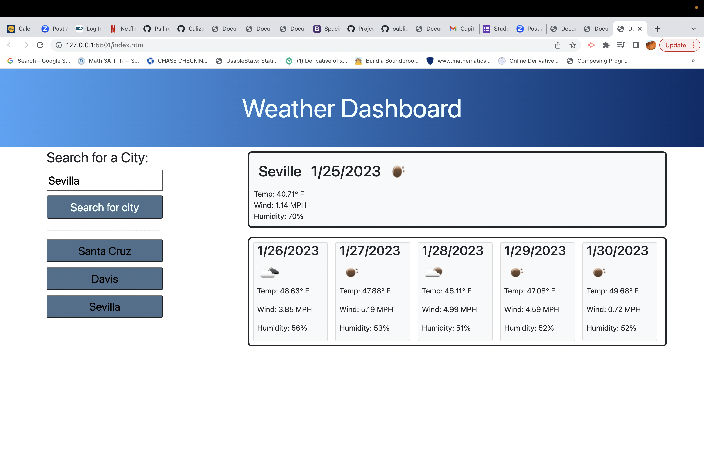

<h1>weatherDashboard</h1>

## Description

- Built a weather app that allows users to search for weather conditions forcast in any city.
- Built this app to augment and develop my abbilites in crating different features and functionality. 
- In addition to giving current weather and forecast, it allows user to click button and view recent searches.
- Learned how to fetch api data and display information to browser. Learned how to capitalize letters using javascript and get input from localStorage to create previous-search buttons.

## Usage

Provide instructions and examples for use. Include screenshots as needed.

To add a screenshot, create an `assets/images` folder in your repository and upload your screenshot to it. Then, using the relative filepath, add it to your README using the following syntax:

## Links

https://caliza.github.io/weatherDashboard/

https://github.com/Caliza/weatherDashboard
    

    
